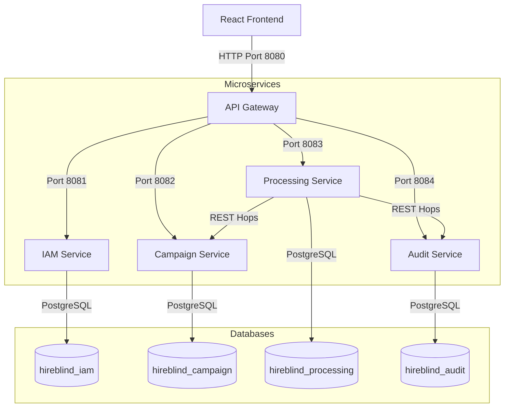
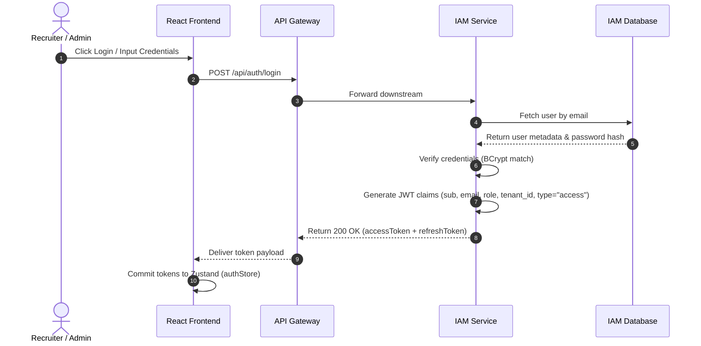
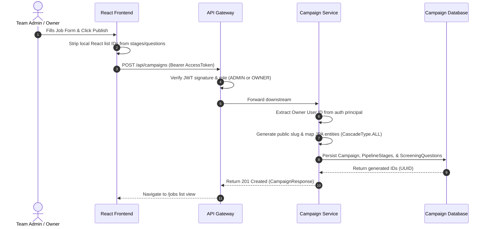
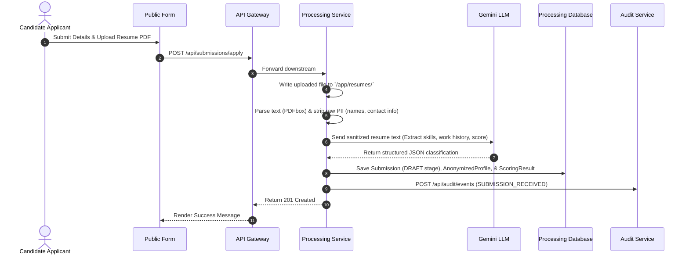
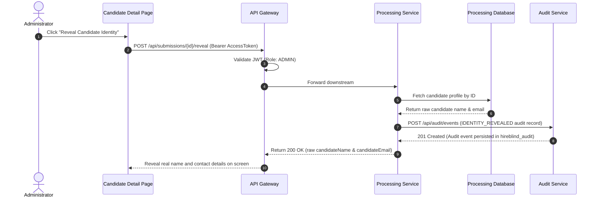

# HireBlind — Comprehensive Platform Context & Architecture Blueprint

This document serves as the absolute, single source of truth for the **HireBlind** codebase. It is designed to provide any Large Language Model (LLM) or incoming software architect with full architectural, security, database, and operational context to confidently continue building, debugging, or scaling the platform.

---

## 1. Project Overview

**HireBlind** is a B2B SaaS HR screening platform designed to eliminate demographic bias from the early stages of hiring. The platform accomplishes this by **automatically parsing, scoring, and anonymizing candidate resumes** before they are reviewed by recruiters.

### Non-Negotiable Core Rules
1. **PII Isolation**: Raw PII (Personally Identifiable Information) must never appear in recruiter-facing response payloads unless an explicit *Reveal Identity* action is executed by an authorized administrator (ADMIN role).
2. **Database Isolation**: Each microservice owns its own database schema. **No cross-service table reads or direct joins are allowed**. Cross-service communication occurs strictly via REST APIs.
3. **LLM Statelessness**: The LLM (Gemini) is a stateless processor. It acts purely as a parsing and classification utility and must never be the source of truth for campaigns, candidates, permissions, or audit trails.
4. **Audit Immutability**: All audit records are write-once, read-only, and completely immutable.
5. **Quality Hardening**: Every feature must have proper validation annotations, logging boundaries, and comprehensive unit/integration test coverage.

---

## 2. System Architecture

HireBlind is built as a microservices architecture communicating over REST APIs. The platform exposes a single entry point through an **API Gateway** which handles perimeter security, rate limiting, and route forwarding.



### Microservice Directory Structure & Port Mapping

| Service | Subdirectory | Port | Responsibilities |
| :--- | :--- | :--- | :--- |
| **API Gateway** | `backend/api-gateway` | `8080` (Public) | Route forwarding, Reactive global CORS/logging, perimeter token signatures & expiration checking. |
| **IAM Service** | `backend/iam-service` | `8081` (Internal) | Authentication, BCrypt password hashing, Google OAuth registration, B2B Tenant partitioning, invite tokens, JWT creation. |
| **Campaign Service**| `backend/campaign-service`| `8082` (Internal) | CRUD for hiring campaigns, pipeline stage configuration, custom screening questions, public/draft statuses. |
| **Processing Service**| `backend/processing-service`| `8083` (Internal) | Candidate resume parsing, LLM-based parsing, scoring, anonymization, candidate file storage, reveal workflows. |
| **Audit Service** | `backend/audit-service` | `8084` (Internal) | Immutable, append-only logs for all platform-wide events (reveal actions, logins, status changes). |

---

## 3. Technology Stack

### Backend Stack
*   **Language**: Java 17
*   **Framework**: Spring Boot 3.x, Spring Web, Spring Cloud Gateway (Reactive)
*   **Security**: Spring Security, JWT (via standard JSON Web Tokens `io.jsonwebtoken:jjwt`), BCrypt
*   **Persistence**: Spring Data JPA, Hibernate, PostgreSQL 16
*   **Migrations**: Flyway Migration Tooling
*   **Logging**: SLF4J, Logback, MDC (Correlation ID tracing)

### Frontend Stack
*   **Language**: TypeScript (Configured with strict type compilation: `"strict": true`)
*   **Framework**: React 19 (Vite 8, React Router 7)
*   **State Management**: Zustand
*   **Data Fetching**: TanStack Query v5 (React Query)
*   **Styling**: Tailwind CSS v3, shadcn/ui, Radix UI primitives, Lucide React icons
*   **Client**: Axios (with centralized `api.ts` response interceptors for 401 token renewals)

---

## 4. Key Data Flows

### A. Authentication & Sign-in Flow
When a user logs in (or utilizes Google OAuth), they receive an short-lived `accessToken` and a long-lived `refreshToken`.



### B. Job Creation & Campaign Publishing Flow
 Hashing out campaigns requires saving pipeline configurations and custom candidate application questions.



### C. Resume Ingestion & LLM Processing Flow
Candidates submit applications publicly. The processing service parses, sanitizes, and evaluates the resume.



### D. Identity Reveal Flow (Restricted)
Recruiters review anonymized candidate profiles. If the profile fits, an ADMIN can reveal the identity, which strictly triggers an immutable audit event.



---

## 5. Security Architecture

### Role-Based Access Controls (RBAC)
The platform defines three core roles:
*   **RECRUITER**: Can view campaigns, list submissions (anonymized profiles), add candidate notes, and update candidate stages. **Strictly forbidden from revealing candidate identities**.
*   **OWNER**: The default role for a user who registers a new tenant (company). Inherits recruiter privileges, plus full control over campaign publishing, team invites, and subscription metrics.
*   **ADMIN**: Global administration permissions. Inherits all recruiter and owner privileges, with the exclusive right to **reveal candidate identities** and download raw candidate resumes.

### JWT Perimeter Verification Filter
The API Gateway hosts perimeter validation via [JwtValidationFilter.java](file:///home/nasirahmed/Desktop/hireblind/backend/api-gateway/src/main/java/com/hireblind/gateway/filter/JwtValidationFilter.java):
*   Validates access tokens against the globally shared `jwt.secret`.
*   Blocks forged, unsigned, or expired tokens *at the perimeter* before they reach downstream microservices.
*   Bypasses public matching patterns explicitly (e.g. `/api/auth/login`, `/api/campaigns/public/**`, and candidate ingestion `/api/submissions/apply`).

---

## 6. Database Schemas & Isolation Model

Each database is created and partitioned on platform initialization using `/infra/init-databases.sql`. Inside each database, Flyway SQL scripts execute automatically on startup.

### IAM Database Schema (`hireblind_iam`)
*   `tenants`: Holds the B2B partitions. Column: `id UUID`, `company_name`, `slug`, `created_at`.
*   `users`: Registered operators. Column: `id UUID`, `email`, `password_hash` (BCrypt), `full_name`, `role` (ADMIN, OWNER, RECRUITER), `tenant_id` (foreign key to `tenants`), `status`.

### Campaign Database Schema (`hireblind_campaign`)
*   `campaigns`: Hiring campaigns. Column: `id UUID`, `title`, `description`, `required_skills_json` (JSONB), `screening_rules_json` (JSONB), `total_vacancies`, `buffer_multiplier`, `public_slug`, `department`, `employment_type`, `location_type`.
*   `pipeline_stages`: Custom hiring pipeline. Column: `id UUID`, `campaign_id` (foreign key to `campaigns`), `name`, `order_index`, `stage_type` (INTAKE, SCREENING, INTERVIEW, OFFER).
*   `screening_questions`: Custom questions. Column: `id UUID`, `campaign_id`, `question_text`, `question_type` (TEXT, LONG_TEXT, BOOLEAN), `is_required`, `options_json`.

### Processing Database Schema (`hireblind_processing`)
*   `submissions`: Candidate records. Column: `id UUID`, `campaign_id` (UUID), `status` (ACTIVE, INACTIVE), `current_stage_id` (UUID), `raw_candidate_name` (PII), `raw_candidate_email` (PII), `resume_file_path`, `revealed` (BOOLEAN).
*   `anonymized_profiles`: Parsed profiles (Zero PII). Column: `id UUID`, `submission_id` (UUID), `summary`, `experience_years`, `skills_json` (JSONB), `work_history_json` (JSONB), `education_json` (JSONB).
*   `scoring_results`: Anonymized LLM evaluation scores. Column: `id UUID`, `submission_id` (UUID), `overall_score` (Integer), `skills_match_score`, `experience_match_score`, `llm_feedback`.

### Audit Database Schema (`hireblind_audit`)
*   `audit_events`: Read-only events. Column: `id UUID`, `event_type` (IDENTITY_REVEALED, LOGIN, CAMPAIGN_CREATED), `actor_id` (UUID), `actor_email`, `entity_id` (UUID), `entity_type`, `description`, `created_at`.

---

## 7. Systemic Code Hardening & History (Resolutions Log)

If an LLM encounters legacy references to issues, consult this log of modifications that successfully secured and hardened the platform:
1.  **Jackson UUID Serialization Conflict**: Jackson originally crashed when deserializing non-UUID strings (`"1"`, etc.) sent from UI form states into UUID fields inside `PipelineStageDto` and `ScreeningQuestionDto`. This was fixed by mapping dynamic React components to submit clean data payloads stripping dummy indexes.
2.  **AuthService Transaction Boundaries**: Resolved transactional lazy initialization crashes during authentication by annotating `AuthService` with `@Transactional`.
3.  **Missing Exception Logging in Campaign/Audit**: Exception handlers originally swallowed backend traces. Centralized `Slf4J` log parameters were integrated into each Advice controller.
4.  **Flyway Dialect Mismatches**: Resolved startup failures across all 4 database-backing microservices by locking Flyway versions and injecting explicit `flyway-database-postgresql` dependency drivers.
5.  **Perimeter Auth Gateway Integration**: Integrated reactive global perimeter token checks inside the API Gateway, stopping raw backend port access directly on public hosts.

---

## 8. Build, Run, & Test Guide

### Local Prerequisites
*   JDK 17 or higher
*   Maven 3.8+
*   NodeJS 20+
*   Docker & Docker Compose

### Step 1: Compile the Backend
Because microservices are segregated, execute compilations individually inside each directory:
```bash
# Example for Campaign Service
cd backend/campaign-service
mvn clean package -DskipTests
```
To build all microservices rapidly in one sequence:
```bash
for dir in backend/*-service/ backend/api-gateway/; do
  echo "Building $dir..."
  (cd "$dir" && mvn clean package -DskipTests)
done
```

### Step 2: Spin Up Containers
Launch PostgreSQL database networks, all 5 microservice containers, and pre-run initialization schemas:
```bash
# Root directory containing docker-compose.yml
docker compose up --build -d
```
Verify container states (all must show `healthy`):
```bash
docker compose ps
```

### Step 3: Launch the Frontend
Navigate into the React source folder and boot the Vite server:
```bash
cd frontend
npm install
npm run dev
```
Open `http://localhost:5173` in your web browser.

### Step 4: Run E2E Verification Tests
To run standard validation queries mapping authenticated JWT requests, candidate reveals, and immutable audits:
```bash
# Seed default users inside iam-service automatically handles auth checks
./test_e2e.sh
```
Seeded test accounts inside IAM migrations:
*   **ADMIN Account**: `nasirworkspace@gmail.com` | Password: `admin123`
*   **RECRUITER Account**: `recruiter@hireblind.com` | Password: `recruiterStrongPass123`
